# Hi there, I'm Shafi! 👋

Welcome to my GitHub profile!  
I'm passionate about code, tech, and solving real-world problems with software.

## 📫 Connect With Me
- GitHub: [@shafisma](https://github.com/shafisma)

## 🛠️ Languages & Tools

## Contributions

  
   
   
  

  <picture>
    <source media="(prefers-color-scheme: dark)" srcset="https://raw.githubusercontent.com/shafisma/shafisma/output/pacman-contribution-graph-dark.svg">
    <source media="(prefers-color-scheme: dark)" srcset="https://raw.githubusercontent.com/shafisma/shafisma/output/pacman-contribution-graph.svg">
    
  </picture>

